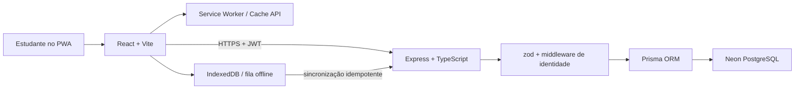

# CampusCycle ♻

Marketplace PWA de economia circular para estudantes universitários. O CampusCycle permite anunciar, doar e encontrar livros, jalecos, calculadoras, eletrônicos, móveis e outros itens dentro do campus, inclusive quando a conexão cai durante a criação de um anúncio.

> Projeto desenvolvido para o desafio técnico de estágio do Laboratório Vortex/UNIFOR. A prioridade foi entregar os requisitos obrigatórios com uma arquitetura pequena, explicável e verificável.

## Produção

- **Aplicação:** [campus-cycles.vercel.app](https://campus-cycles.vercel.app)
- **API:** [campuscycle-a08p.onrender.com](https://campuscycle-a08p.onrender.com/api/health)
- **Dados de impacto:** [`GET /api/stats`](https://campuscycle-a08p.onrender.com/api/stats)

O backend usa o plano gratuito do Render. Se ele estiver frio, a primeira requisição pode levar alguns segundos; a interface informa esse estado e tenta novamente.

## O que foi entregue

- landing page responsiva com **O PLACAR**, contador de impacto ambiental e econômico;
- vitrine paginada com busca textual e filtros por categoria e doação;
- cadastro e login com JWT;
- criação, visualização, atualização de status e remoção de anúncios do próprio usuário;
- preço em centavos no banco e `null` como representação de doação;
- PWA instalável, com fontes e shell da aplicação disponíveis offline;
- leitura offline do feed e do placar por cache `NetworkFirst`;
- fila de anúncios offline em IndexedDB com estados `pending`, `synced` e `failed`;
- sincronização ao reconectar ou reabrir a aplicação;
- idempotência ponta a ponta por UUID criado no cliente;
- envelopes de erro consistentes, validação zod e controles de segurança;
- deploy independente do frontend, da API e do banco;
- 57 casos de teste automatizados, além do fluxo offline repetido três vezes em Android físico.

## O diferencial offline

O Service Worker e a fila offline têm responsabilidades diferentes:

- o **Service Worker** mantém leitura e navegação disponíveis por meio de precache e runtime cache;
- o **IndexedDB** preserva escritas que ainda não chegaram ao servidor.

Ao criar um anúncio sem rede, a aplicação valida os dados, guarda o payload e o mesmo UUID no IndexedDB e mostra o item em “Meus anúncios” como aguardando sincronização. Quando a conexão volta, a fila envia o item. O servidor trata uma repetição do UUID do mesmo dono como sucesso idempotente, evitando anúncios duplicados.

```text
preencher e validar
        |
        v
POST online? ---- sim ----> API ----> Postgres
        |
       não
        v
IndexedDB: pending
        |
  evento online ou load
        v
pending ---> synced
   |
   +------> failed, quando o erro é definitivo
```

O fluxo foi validado três vezes em um PWA instalado em Android físico: criar em modo avião, visualizar o selo local, reconectar e acompanhar a mudança para publicado.

## Arquitetura

O repositório é um monorepo sem workspaces e sem `package.json` na raiz. Cada aplicação possui ciclo de instalação, build e deploy próprio.



| Camada | Tecnologia | Responsabilidade |
|---|---|---|
| Interface | React 19, React Router, CSS | páginas, filtros, formulários e estados de UX |
| PWA | Vite, vite-plugin-pwa, Workbox | instalação, precache, navegação e leitura offline |
| Escrita offline | IndexedDB com `idb` | persistência e sincronização da fila |
| API | Node.js, Express, TypeScript | contratos HTTP, autenticação, autorização e regras |
| Validação | zod | validação de toda escrita no servidor e antes da fila |
| Dados | Prisma, PostgreSQL | persistência, índices, agregações e migrations |
| Produção | Vercel, Render, Neon | frontend, API e banco gerenciados separadamente |

### Estrutura

```text
campuscycle/
├── server/                 # API REST, Prisma, migrations, seed e testes
├── web/                    # PWA React, Service Worker e testes da fila
├── docs/
│   ├── design-doc.md       # plano e decisões de arquitetura
│   ├── test-plan.md        # plano de testes e caminhos críticos
│   └── diario-de-bordo.md  # registro cronológico do uso de IA
├── DESIGN.md               # design system Xilo-Feira
├── TODOS.md                # diferimentos e limites deliberados
└── docker-compose.yml      # PostgreSQL local opcional
```

## Como executar localmente

Pré-requisitos:

- Node.js 20 ou superior;
- npm;
- Docker, para o caminho local recomendado, **ou** um banco PostgreSQL/Neon próprio.

### Opção A: PostgreSQL com Docker

Na raiz do repositório:

```bash
docker compose up -d db
```

Prepare e execute a API:

```bash
cd server
cp .env.example .env
npm ci
npm run prisma:deploy
npx prisma db seed
npm run dev
```

Em outro terminal, prepare o frontend:

```bash
cd web
cp .env.example .env
npm ci
npm run dev
```

A aplicação abre em `http://localhost:5173` e a API em `http://localhost:3001`.

No PowerShell, substitua `cp` por `Copy-Item`.

### Opção B: Neon ou outro PostgreSQL

Copie `server/.env.example` para `server/.env` e informe:

- `DATABASE_URL`: URL usada em runtime; no Neon, use a URL pooled com `?pgbouncer=true&connect_timeout=15`;
- `DIRECT_URL`: URL direta, sem pooler, usada pelas migrations.

Depois execute os mesmos comandos de instalação, migration, seed e desenvolvimento da opção A.

> O seed apaga os dados das tabelas antes de inserir a demonstração. Use-o apenas em um banco descartável. A suíte do servidor também possui uma trava que bloqueia bancos remotos por padrão.

### Escolher o modo de identidade

O servidor e o frontend devem usar o mesmo modo. Os resolvers são exclusivos e nunca são empilhados.

Para desenvolvimento anônimo:

```dotenv
# server/.env
IDENTITY_MODE="anonymous"

# web/.env
VITE_IDENTITY_MODE="anonymous"
```

Para autenticação JWT:

```dotenv
# server/.env
IDENTITY_MODE="jwt"
JWT_SECRET="substitua-por-um-segredo-longo-e-aleatorio"

# web/.env
VITE_IDENTITY_MODE="jwt"
```

No modo JWT, o header `X-User-Id` é ignorado. No modo anônimo, as rotas de autenticação não são montadas.

## Variáveis de ambiente

### API (`server/.env`)

| Variável | Obrigatória | Uso |
|---|---:|---|
| `DATABASE_URL` | sim | conexão de runtime com PostgreSQL |
| `DIRECT_URL` | sim | migrations Prisma sem pooler |
| `IDENTITY_MODE` | sim | `anonymous` ou `jwt` |
| `JWT_SECRET` | em modo JWT | assinatura dos tokens de sete dias |
| `WEB_ORIGIN` | em produção | origem exata do frontend para CORS |
| `PORT` | não | porta local; padrão `3001` |

### PWA (`web/.env`)

| Variável | Obrigatória | Uso |
|---|---:|---|
| `VITE_API_URL` | sim | URL base da API |
| `VITE_IDENTITY_MODE` | sim | deve espelhar o modo da API |

## API

Todas as falhas usam o envelope:

```json
{
  "error": {
    "code": "ERROR_CODE",
    "message": "Mensagem legível",
    "details": []
  }
}
```

`details` só aparece quando há informações adicionais, como erros de validação.

| Método | Rota | Autenticação | Descrição |
|---|---|---:|---|
| `GET` | `/api/health` | não | saúde da API |
| `GET` | `/api/stats` | não | totais e impacto agregado |
| `POST` | `/api/auth/register` | não | cria sempre um usuário novo |
| `POST` | `/api/auth/login` | não | autentica e retorna JWT |
| `GET` | `/api/listings` | não | feed paginado e filtrável |
| `GET` | `/api/listings/mine` | sim | anúncios da identidade atual |
| `GET` | `/api/listings/:id` | não | detalhe público |
| `POST` | `/api/listings` | sim | cria anúncio; retry idempotente |
| `PATCH` | `/api/listings/:id` | sim, dono | altera título, descrição, preço ou status |
| `DELETE` | `/api/listings/:id` | sim, dono | remove anúncio |

Filtros do feed:

```http
GET /api/listings?page=1&category=Livros&q=cálculo&donation=true
```

Respostas públicas usam seleção explícita do Prisma e não expõem `userId`.

## Testes e verificações

```bash
# API: requer PostgreSQL local ou explicitamente autorizado
cd server
npm test
npm run build

# PWA
cd web
npm test
npm run build
```

A cobertura automatizada contém 57 casos:

- **35 no servidor:** CRUD, filtros, paginação, ownership, validação, autenticação, resolver exclusivo, rate limit, idempotência e matemática do placar;
- **22 no frontend:** oito transições da fila offline, cinco regras de merge de “Meus anúncios” e nove casos de preço/doação.

Os testes automatizados não substituem os gates manuais do PWA. O plano completo de rotas, estados, acessibilidade e modo avião está em [`docs/test-plan.md`](./docs/test-plan.md).

## Segurança e confiabilidade

- `express.json({ limit: '50kb' })` e zod em toda rota de escrita;
- rate limit aproximado de 20 escritas por 15 minutos por IP;
- `trust proxy` limitado a um salto no Render;
- JWT com expiração de sete dias e senhas com bcrypt;
- mesma resposta para e-mail inexistente e senha incorreta;
- autorização por dono em `PATCH` e `DELETE`;
- `userId` ausente de respostas públicas;
- registro nunca reivindica um UUID anônimo, evitando account takeover;
- troca de identidade apaga o runtime cache da API;
- proteção contra testes destrutivos em banco remoto;
- logs estruturados com pino.

## Decisões e limites conscientes

- **JWT em `localStorage`:** suficiente para a demonstração; em produção real, a migração seria para cookie `httpOnly` com proteção CSRF.
- **Listener `online` em vez de Background Sync:** funciona em mais navegadores e mantém uma única lógica de sincronização. Background Sync ficou como extensão opcional.
- **Schema zod copiado de forma disciplinada:** evita criar um terceiro pacote no monorepo pequeno. O cabeçalho dos arquivos registra a obrigação de sincronia.
- **URL de imagem em vez de upload:** evita blobs na fila offline e dependência de storage externo.
- **Piso simulado no placar:** o edital permite estatísticas simuladas; os dados reais do banco são somados a um piso explícito e documentado.
- **CORS restrito:** produção e localhost são aceitos; previews efêmeros da Vercel não fazem parte do escopo.

Os itens deliberadamente adiados e seus motivos estão em [`TODOS.md`](./TODOS.md).

## Design system

O sistema visual **Xilo-Feira** combina papel, tinta e cartazes de feira universitária:

- papel `#FBF8F0`, tinta `#141613` e verde `#0B7A3E`;
- amarelo `#FFD100` reservado a dinheiro e foco;
- bordas sólidas de 2 px e sombras duras;
- Alfa Slab One nos títulos, Archivo na interface e Chivo Mono nos carimbos;
- fontes self-hosted e precacheadas para preservar a identidade offline;
- movimento restrito a `transform` e `opacity`, com suporte a `prefers-reduced-motion`.

A especificação visual e o registro de decisões estão em [`DESIGN.md`](./DESIGN.md).

## Diário de Bordo da IA

IA foi tratada como ferramenta de implementação e revisão, não como fonte de verdade. O processo completo, com prompts e incidentes em ordem cronológica, está em [`docs/diario-de-bordo.md`](./docs/diario-de-bordo.md).

### Ferramentas utilizadas

- Claude Code e OpenAI Codex para planejamento, implementação assistida, revisão e documentação;
- fluxos gstack para revisão de produto, engenharia, design, QA e restauração de contexto;
- revisões adversariais com contexto limpo para desafiar decisões antes da implementação.

### Exemplos de prompts reais

> “Acesse as docs do planejamento e comecemos a implementar; todas as specs e docs do processo de engenharia versionadas no git; poucos commits, apenas grandes progressos.”

> “Vamos fazer o QA com fluxo completo do nosso app, teste e valide todas as funcionalidades, incluindo possíveis erros de inconsistência em design UI/UX.”

> “Já repeti três vezes a cena offline no Android. Crie uma documentação detalhada explicando todo o projeto em camadas e tudo que devo saber explicar durante o vídeo. Não faça commit.”

### Registros das conversas

Os trechos de prompts, decisões, correções e resultados foram registrados no Diário no momento de cada sessão. Os documentos [`docs/design-doc.md`](./docs/design-doc.md), [`docs/test-plan.md`](./docs/test-plan.md), [`DESIGN.md`](./DESIGN.md) e [`TODOS.md`](./TODOS.md) preservam as decisões produzidas e revisadas nessas conversas. Chats completos não foram publicados para evitar expor contexto local e credenciais acidentais.

### Reflexão crítica

O caso mais grave ocorreu durante um QA: a IA executou a suíte do servidor enquanto o `.env` local ainda apontava para o Neon de produção usado no seed. O setup dos testes fazia `deleteMany()`, e o banco de demonstração foi apagado. O problema foi detectado ao conferir `/api/stats`, os 24 anúncios foram restaurados pelo seed e o código ganhou uma trava que aborta testes quando `DATABASE_URL` não é local, salvo liberação explícita.

A lição não foi “a IA errou uma vez”, mas que comandos destrutivos não podem depender de atenção ou contexto implícito. O controle correto foi transformar a regra em código verificável. Outros erros encontrados por revisão humana e QA incluem instalação de dependências no diretório errado, fontes ausentes do precache, CORS incorreto, deep-links quebrados, placar sem cache offline e a criação de doações bloqueada por um ramo não testado.

## Documentação

- [`docs/design-doc.md`](./docs/design-doc.md): plano aprovado, arquitetura e decisões;
- [`DESIGN.md`](./DESIGN.md): sistema visual Xilo-Feira;
- [`docs/test-plan.md`](./docs/test-plan.md): matriz de testes e caminhos críticos;
- [`docs/diario-de-bordo.md`](./docs/diario-de-bordo.md): Diário de Bordo completo;
- [`TODOS.md`](./TODOS.md): extensões, limites e diferimentos deliberados.

---

Desenvolvido como uma demonstração técnica de produto, engenharia web e curadoria responsável de IA.
